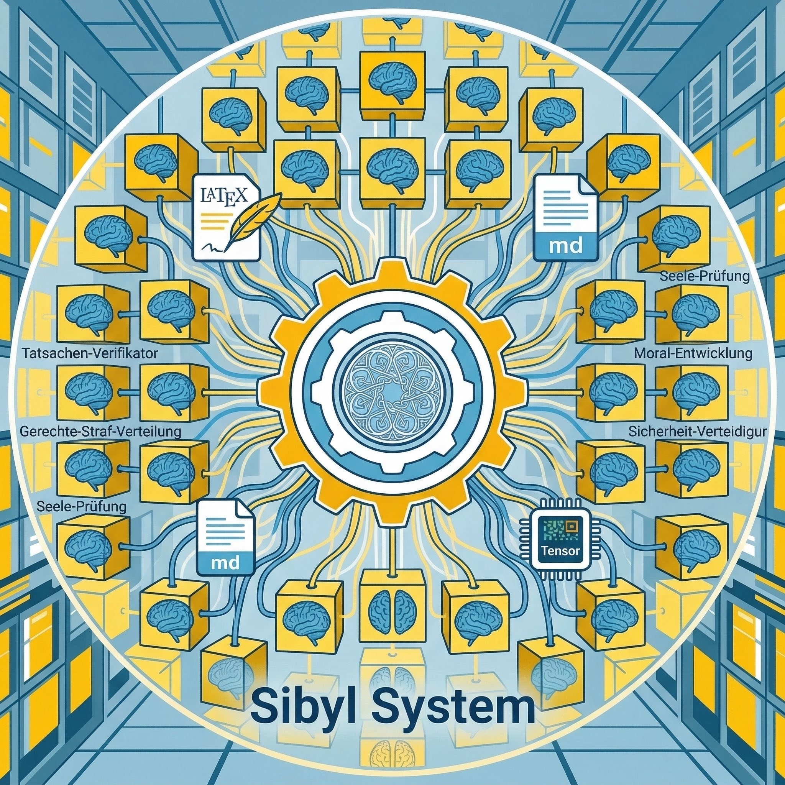

<p align="center">
  
  <h1 align="center">Sibyl Research System</h1>
  <p align="center"><b>Fully Autonomous AI Research System with Self-Evolution</b></p>
</p>

[](LICENSE)

> Inspired by the pioneering work of [The AI Scientist](https://github.com/SakanaAI/AI-Scientist), [FARS](https://analemma.ai/blog/introducing-fars/), and [AutoResearch](https://github.com/karpathy/autoresearch), Sibyl takes the vision further by building natively on [Claude Code](https://docs.anthropic.com/en/docs/claude-code) to fully leverage its agent ecosystem — skills, plugins, MCP servers, and multi-agent teams.

[中文文档](README_CN.md)

Sibyl is a **fully automated scientific discovery system** that autonomously drives ML research from literature survey to paper submission. It operates as an **autonomous research organization**: 20+ specialized AI agents debate ideas, design and run GPU experiments, write papers, and critically review their own work — all without human intervention.

What truly sets Sibyl apart is its **dual-loop architecture**:

- **Inner Loop — Research Iteration**: Each project automatically iterates across every dimension — refining hypotheses based on experiment results, re-planning experiments, rewriting papers, pivoting to alternative ideas when needed — until quality meets publication standards.
- **Outer Loop — System Self-Evolution**: Sibyl learns from the research process itself. After every iteration, it classifies issues across 8 categories, tracks which lessons actually improve outcomes, and automatically updates its own agent prompts, scheduling strategies, and architectural patterns. **The system that runs your research is itself getting better at running research.**

### What Makes Sibyl Different?

- **Autonomous Multi-Dimensional Iteration** — Not just "run experiments and write a paper." Every aspect of the research improves automatically across iterations: ideas sharpen through multi-agent debate, experiments expand with better baselines and ablations, writing tightens under 6-agent cross-review, and resource utilization optimizes through GPU scheduling feedback. The quality gate decides when to stop or pivot — no human in the loop.
- **Self-Evolving System** — Most AI research tools are static — they run the same way every time. Sibyl evolves. It extracts lessons from every research iteration (issues, success patterns, efficiency metrics), evaluates their effectiveness over time, and injects proven improvements back into agent prompts. Ineffective lessons are automatically deprioritized. Across projects, the system accumulates institutional knowledge — each project makes every future project better.
- **Claude Code Native** — Not a wrapper around API calls. Built directly on Claude Code's architecture (fork skills, agent teams, MCP tools), inheriting its full ecosystem: SSH remote execution, multi-model collaboration (Claude + GPT-5.4 cross-review), Feishu/Lark cloud sync, and more.

---

## Get Started

### Recommended: Let Claude Configure Everything

The fastest way to set up Sibyl is to let Claude Code do it for you. Clone the repo, open it in Claude Code, and ask:

```bash
git clone https://github.com/Sibyl-Research/sibyl-research-system.git
cd sibyl-research-system
tmux new -s sibyl                                           # recommended: persistent session
claude --plugin-dir ./plugin --dangerously-skip-permissions
```

> ⚠️ `--dangerously-skip-permissions` grants Claude Code unrestricted execution (shell commands, file I/O, MCP calls) without confirmation. It is strongly recommended for Sibyl's autonomous multi-agent workflow (hundreds of tool calls per iteration), but should only be used on dedicated research machines. See [Manual Setup](#manual-setup) for full details and mitigation advice.

Then tell Claude:

> **"Help me set up Sibyl Research System. Read docs/setup-guide.md and configure everything."**

Claude will automatically check your environment, install dependencies, configure MCP servers, create config files, and ask you only for what it can't detect (GPU server IP, username, etc.). The [setup guide](docs/setup-guide.md) is a step-by-step checklist designed for Claude to follow.

### Manual Setup

<details>
<summary>Click to expand manual setup instructions</summary>

#### Prerequisites

- Python 3.12+, Node.js 18+
- [Claude Code CLI](https://docs.anthropic.com/en/docs/claude-code)
- GPU server with SSH access
- `ANTHROPIC_API_KEY` environment variable
- `CLAUDE_CODE_EXPERIMENTAL_AGENT_TEAMS=1` environment variable
- **tmux** (strongly recommended) — enables persistent sessions and automatic recovery via Sentinel watchdog. Install: `brew install tmux` (macOS) / `apt install tmux` (Linux)

#### 1. Install

```bash
git clone https://github.com/Sibyl-Research/sibyl-research-system.git
cd sibyl-research-system
chmod +x setup.sh && ./setup.sh    # Interactive: creates venv, installs deps, configures MCP
```

#### 2. Configure MCP Servers

Two MCP servers are required. `setup.sh` configures them interactively, but for manual setup the preferred path is `claude mcp add --scope local ...` so the configuration stays repo-scoped:

```bash
claude mcp add --scope local ssh-mcp-server -- npx -y @fangjunjie/ssh-mcp-server \
  --host YOUR_GPU_IP --port 22 --username YOUR_USER --privateKey ~/.ssh/id_ed25519

claude mcp add --scope local arxiv-mcp-server -- /ABSOLUTE/PATH/TO/sibyl-research-system/.venv/bin/python3 -m arxiv_mcp_server
```

If you already manage Claude Code MCP servers through JSON, update the existing MCP config instead of creating a second source of truth:

```json
{
  "mcpServers": {
    "ssh-mcp-server": {
      "command": "npx",
      "args": ["-y", "@fangjunjie/ssh-mcp-server",
               "--host", "YOUR_GPU_IP", "--port", "22",
               "--username", "YOUR_USER",
               "--privateKey", "~/.ssh/id_ed25519"]
    },
    "arxiv-mcp-server": {
      "command": "/ABSOLUTE/PATH/TO/sibyl-research-system/.venv/bin/python3",
      "args": ["-m", "arxiv_mcp_server"]
    }
  }
}
```

> Server names must be exact: `"ssh-mcp-server"` and `"arxiv-mcp-server"`.

#### 3. Configure GPU Server

Create `config.yaml` at project root (git-ignored):

```yaml
ssh_server: "default"
remote_base: "/home/user/sibyl_system"
max_gpus: 4
language: zh
codex_enabled: false
```

Use `ssh_server: "default"` when `ssh-mcp-server` was registered with explicit `--host/--username` arguments. If your MCP setup resolves a named SSH host alias instead, use that alias.

#### 4. Run

```bash
# Strongly recommended: run inside tmux for persistent sessions
tmux new -s sibyl

# Strongly recommended: use --dangerously-skip-permissions for fully autonomous operation
claude --plugin-dir ./plugin --dangerously-skip-permissions

# Inside Claude Code:
/sibyl-research:init              # Create a research project
/sibyl-research:start <project>   # Start autonomous research loop
```

> **Why tmux?** Sibyl experiments can run for hours. Running inside tmux ensures the session persists through terminal disconnections. The Sentinel watchdog (auto-launched by `/sibyl-research:start`) runs in a sibling tmux pane and automatically restarts Claude Code if it crashes or goes idle — enabling truly unattended autonomous research.

> **Why `--dangerously-skip-permissions`?** Sibyl orchestrates 20+ agents across 19 pipeline stages, each involving dozens of tool calls (file I/O, SSH commands, MCP server calls, sub-agent spawning). Without this flag, Claude Code will prompt for permission on nearly every operation, making autonomous research impossible — you'd need to approve hundreds of prompts per iteration. The flag skips all permission confirmations, enabling true end-to-end automation.
>
> **⚠️ Risks**: This flag allows Claude Code to execute **any** shell command, read/write **any** file, and make **any** MCP call without confirmation. Only use it in environments where you trust the system and have reviewed the codebase. Do not use it on machines with sensitive data outside the project directory. Consider running in a container or VM for additional isolation.

</details>

> **Docs**: [Full Setup Guide](docs/setup-guide.md) · [Configuration (35+ options)](docs/configuration.md) · [MCP Servers](docs/mcp-servers.md) · [SSH & GPU](docs/ssh-gpu-setup.md) · [All 12 Commands](docs/plugin-commands.md)

---

## System Overview

Sibyl orchestrates 20+ AI agents through a **19-stage state-machine pipeline**, automatically completing literature survey, idea generation, experiment design & execution, result analysis, paper writing, and peer review. The system supports multi-round iterative optimization with built-in cross-project learning that continuously improves research quality.


### Core Features

- **19-Stage Research Pipeline**: End-to-end automation from literature search to camera-ready paper
- **Multi-Agent Collaboration**: 6-agent debate for idea generation, 6-agent result analysis, 6-agent parallel writing
- **GPU-Parallel Scheduling**: Topological sort + dynamic dispatch, maximizing GPU utilization with automatic task dependency management
- **Autonomous Iterative Optimization**: Quality gate auto-decides whether to continue iterating, pivot to new ideas, or terminate — every dimension of research improves across iterations
- **Self-Evolving System**: Automatically extracts lessons across 8 categories, tracks effectiveness, prunes what doesn't work, and updates agent prompts — the system improves itself with every project
- **Self-Healing System**: Background agent continuously monitors for runtime errors, auto-fixes them using skill pipelines, adds regression tests, and commits fixes — all without human intervention
- **Multi-Model Collaboration**: Claude Opus/Sonnet + GPT-5.4 (Codex) independent cross-review

## Pipeline

```
+== Research Iteration =============+  +== Paper Writing ====================+
|                                    |  |                                     |
|  Literature Search (arXiv + Web)   |  |  Outline                            |
|       |                            |  |       |                             |
|       v                            |  |       v                             |
|  Idea Debate (6 Agents)            |  |  Section Writing (seq/para/Codex)   |
|       |                            |  |       |                             |
|       v                            |  |       v                             |
|  Experiment Planning               |  |  Cross Review (6 Agents)            |
|       |                            |  |       |                             |
|       v                            |  |       v                             |
|  Pilot Experiments                 |  |  Integration & Editing              |
|       |                            |  |       |                             |
|       v                            |  |       v                             |
|  Full Experiments (GPU parallel)   |  |  Final Review (NeurIPS level)       |
|       |                            |  |       | fail --> back to edit (x2)  |
|       v                            |  |       v                             |
|  Result Debate (6 Agents)          |  |  LaTeX --> compile PDF              |
|       |                            |  |       |                             |
|       v                            |  +-------|---------+-------------------+
|  Decision                          |          |
|       | PIVOT --> back to Idea     |          |
|       | PROCEED                    |          v
+-------|-----------+----------------+  +== Review & Reflection ==============+
        |                               |                                     |
        +----------> Outline            |  Review (Critic+Supervisor+Codex)    |
                                        |       |                             |
                                        |       v                             |
                                        |  Reflection (lessons learned)       |
                                        |       |                             |
                                        |       v                             |
                                        |  Lark Sync (cloud docs)             |
                                        |       |                             |
                                        |       v                             |
                                        |  Quality Gate                       |
                                        |       | >= 8.0 & >= 2 iter --> DONE |
                                        |       | else --> next iteration     |
                                        |                                     |
                                        +-------------------------------------+
```

### Stage Details

| Stage | Description | Agent Mode |
|-------|-------------|-----------|
| `literature_search` | Dual-source survey via arXiv + Web | Single Agent |
| `idea_debate` | 6-perspective idea debate (Innovator / Pragmatist / Theorist / Contrarian / Interdisciplinary / Empiricist) | 6-Agent Team |
| `planning` | Design experiments, generate task_plan.json with dependencies | Single Agent |
| `pilot_experiments` | Small-scale feasibility validation | Single Agent |
| `experiment_cycle` | GPU-parallel full experiments, topologically sorted batch scheduling | Single Agent + GPU Scheduler |
| `result_debate` | 6-perspective result analysis (Optimist / Skeptic / Strategist / Methodologist / Comparativist / Revisionist) | 6-Agent Team |
| `experiment_decision` | Supervisor decision: PIVOT (change direction) or PROCEED | Single Agent |
| `writing_outline` | Generate paper outline | Single Agent |
| `writing_sections` | Write by section (sequential / parallel / Codex modes) | Configurable |
| `writing_critique` | 6-agent cross-review of each section | 6-Agent Parallel |
| `writing_integrate` | Editor integrates into complete paper | Single Agent |
| `writing_final_review` | NeurIPS/ICML-level final review (can loop for revision) | Single Agent |
| `writing_latex` | Convert to NeurIPS LaTeX format and compile PDF | Single Agent |
| `review` | Critic + Supervisor + Codex parallel review | Parallel Skills |
| `reflection` | Classify issues, generate improvement plan, record lessons | Single Agent |
| `lark_sync` | Sync research data to Feishu/Lark cloud docs | Single Agent |
| `quality_gate` | Evaluate completion (≥8.0 score and ≥2 iterations) | Automatic |

## Agent Roles

### Idea Generation Team

| Agent | Perspective | Responsibility |
|-------|------------|----------------|
| Innovator | Cross-domain innovation | Bold methodology transfer and novel combinations |
| Pragmatist | Engineering feasibility | Ensure ideas are implementable |
| Theorist | Mathematical foundations | Focus on theoretical guarantees and proofs |
| Contrarian | Challenge assumptions | Find counter-evidence and blind spots |
| Interdisciplinary | Analogical inspiration | Import methods from cognitive science, physics, biology |
| Empiricist | Experiment-first | Focus on reproducibility and data quality |

### Result Analysis Team

| Agent | Perspective | Responsibility |
|-------|------------|----------------|
| Optimist | Positive findings | Discover positive results and extension directions |
| Skeptic | Statistical rigor | Question statistical significance and confounders |
| Strategist | Next steps | Suggest resource allocation and research direction |
| Methodologist | Method review | Evaluate internal and external validity |
| Comparativist | SOTA benchmarking | Compare and position against existing best methods |
| Revisionist | Hypothesis revision | Reflect on and adjust hypotheses based on results |

### Model Tiers

| Tier | Model | Usage |
|------|-------|-------|
| Heavy | Opus 4.6 | Synthesis, supervision, editing, criticism, reflection |
| Standard | Opus 4.6 | Literature survey, planning, experiments, writing |
| Light | Sonnet 4.6 | Result debate, cross-review, section critique |
| Codex | GPT-5.4 High | Independent third-party review, optional writing mode |

## Self-Evolution System

Sibyl doesn't just run research — it learns how to run research better. After every iteration, the system analyzes what worked, what failed, and what was inefficient, then automatically updates itself:

```
Research Iteration completes
       |
       v
  Reflection Agent ──> Analyze outcomes across 8 dimensions
       |                    ├── Experiment design quality
       |                    ├── Writing clarity & structure
       |                    ├── Resource efficiency (GPU utilization, scheduling)
       |                    ├── Idea novelty & contribution
       |                    └── System reliability, analysis depth, planning, pipeline
       v
  Evolution Engine ──> Track & evaluate lessons
       |                    ├── Time-weighted frequency analysis (30-day half-life)
       |                    ├── Effectiveness scoring (early vs late iteration comparison)
       |                    └── Success pattern extraction (what to keep doing)
       v
  Auto-Update ──> Inject proven improvements into agent prompts
       |              ├── Effective lessons: boosted priority
       |              ├── Ineffective lessons: 0.3x deprioritized (auto-pruned)
       |              └── Efficiency insights: scheduling & resource optimization
       v
  Self-Check ──> Detect systemic anomalies
                    ├── Declining quality trend across iterations
                    ├── Recurring errors that lessons haven't fixed
                    └── Ineffective lesson accumulation
```

### Why Self-Evolution Actually Works

Most AI systems that claim to "learn" are stateful processes — they accumulate context within a single session, but lose everything when the process restarts. Sibyl takes a fundamentally different approach: **stateless architecture with persistent artifacts**.

- **Every prompt is loaded from disk at call time.** There is no in-memory cache, no long-running daemon. Each agent reads its prompt file (`sibyl/prompts/*.md`) fresh every time it is invoked. If the evolution engine rewrites a prompt, the very next agent call picks up the change — zero restart, zero redeployment.
- **Every agent runs as an independent subprocess.** Skills execute via `python3 -c "..."` in a fresh process, so Python modules are re-imported every time. Code changes in `sibyl/*.py` take effect immediately on the next stage.
- **Config is re-parsed per orchestrator call.** `cli_next()` instantiates a new `Orchestrator` each time, re-reading `config.yaml` from disk. Parameter tuning by the evolution engine is picked up on the next tick.
- **Lesson overlays are plain files.** Experience extracted from past projects is written to `~/.claude/sibyl_evolution/lessons/{agent}.md`. The `load_prompt()` function appends the overlay content on every call — new lessons are injected into the next agent invocation automatically.

This means evolution is not a "batch update" that requires a maintenance window. It is a **continuous, incremental process**: the system that runs iteration N+1 is already different from the one that ran iteration N, because the reflection after iteration N has already modified prompts, overlays, and potentially code on disk. The entire system is designed so that **every file is the source of truth, and every file is read fresh** — making self-evolution a natural consequence of the architecture rather than a bolted-on feature.

**Safety**: All system file modifications are gated by mandatory tests (`.venv/bin/python3 -m pytest tests/`) and tracked via git commits, ensuring every evolution step is reversible and auditable.

**8 Issue Categories**: SYSTEM, EXPERIMENT, WRITING, ANALYSIS, PLANNING, PIPELINE, IDEATION, EFFICIENCY — each automatically routed to the relevant agents. The planner learns to design better experiments, the experimenter learns to use GPUs more efficiently, the writer learns to avoid recurring style issues — all without manual intervention.

## Self-Healing System

While the self-evolution system learns from *completed* iterations, the **self-healing system** operates in real time — continuously monitoring for runtime errors and fixing them autonomously as the research pipeline runs.

```
Runtime Error Occurs
       |
       v
  Error Collector ──> Structured capture to logs/errors.jsonl
       |                    ├── Exception type, traceback, file, line
       |                    ├── Pipeline stage & project context
       |                    └── Automatic categorization (7 types)
       v
  Error Router ──> Intelligent triage
       |                    ├── Deduplication (hash-based)
       |                    ├── Priority sorting (import > build > type > test > ...)
       |                    ├── Skill routing (error type → repair skill pipeline)
       |                    └── Circuit breaker (3 failures → escalate to human)
       v
  Self-Healer Agent ──> Autonomous repair
       |                    ├── Invoke mapped skills (systematic-debugging, tdd-workflow, ...)
       |                    ├── Apply fix with scope limits (max 5 files, protected file rules)
       |                    ├── Generate regression test to prevent recurrence
       |                    └── Verify: full test suite must pass
       v
  Git Commit ──> fix(self-heal): <description> [auto]
                    └── All fixes tracked on dev branch, periodically synced to main
```

### How It Works

The self-healing system is a **three-layer architecture**:

1. **Error Collector** (`sibyl/error_collector.py`) — Captures runtime exceptions with full context (traceback, stage, project) into structured JSONL records. A `@wrap_cli` decorator automatically catches errors from all orchestrator CLI functions. Errors are categorized into 7 types: `import`, `test`, `type`, `state`, `config`, `build`, `prompt`.

2. **Error Router** (`sibyl/self_heal.py`) — Deduplicates errors by content hash, sorts by priority (import errors before config errors), and maps each error category to a repair skill pipeline via the **skill route table**. A circuit breaker prevents infinite fix loops: after 3 failed attempts on the same error, it is marked for human intervention.

3. **Self-Healer Agent** (`sibyl-self-healer` skill) — A fork skill running on the standard tier (Opus) that receives repair tasks and autonomously:
   - Invokes the appropriate skills (e.g., `systematic-debugging` → `tdd-workflow`)
   - Applies the fix within scope limits (max 5 files per fix, surgical changes to protected files)
   - Writes a regression test covering the exact failure condition
   - Runs the full test suite to verify the fix
   - Commits with `fix(self-heal): ... [auto]` format for full traceability

### Safety Mechanisms

| Mechanism | Purpose |
|-----------|---------|
| Circuit breaker | Same error failing 3 times → stops and flags for human review |
| File scope limit | Max 5 files modified per fix — prevents over-reaching changes |
| Protected files | Core files like `orchestrate.py` only allow minimal, surgical edits |
| Test gate | Full test suite must pass before any fix is committed |
| Git tracking | Every fix is a separate commit on `dev` — fully reversible |

### Configuration

```yaml
self_heal_enabled: true        # Enable self-healing (default: true)
self_heal_interval_sec: 300    # Background scan interval (default: 5 min)
self_heal_max_attempts: 3      # Circuit breaker threshold (default: 3)
```

## Project Structure

```
sibyl-system/
├── sibyl/                      # Core Python modules
│   ├── orchestrate.py          # State-machine orchestrator (19-stage pipeline)
│   ├── config.py               # Configuration (models/GPU/modes)
│   ├── workspace.py            # Workspace file & Git management
│   ├── gpu_scheduler.py        # GPU topological sort & parallel scheduling
│   ├── evolution.py            # Cross-project evolution engine
│   ├── reflection.py           # Iteration logging
│   ├── error_collector.py      # Structured error capture for self-healing
│   ├── self_heal.py            # Error routing, circuit breaker, repair orchestration
│   └── prompts/                # 33 agent prompt templates
├── .claude/
│   ├── agents/                 # Agent tier definitions (heavy/standard/light)
│   └── skills/sibyl-*/         # 30+ Fork Skills (isolated context execution)
├── plugin/commands/            # Claude Code plugin commands
├── workspaces/                 # Research project workspaces
├── tests/                      # Unit tests (~320 tests)
└── requirements.txt            # Dependencies (PyYAML, rich)
```

### Workspace Structure

Each research project has an independent filesystem under `workspaces/<project>/`:

```
workspaces/<project>/
├── status.json                 # Orchestrator state (stage/iteration/score)
├── config.yaml                 # Project-level config overrides
├── topic.txt / spec.md         # Research topic & requirements spec
├── context/literature.md       # Literature review
├── idea/                       # Proposals, alternatives, debate records
├── plan/                       # Experiment plan, task_plan.json
├── exp/                        # Code, results, logs, GPU progress
├── writing/                    # Outline, sections, reviews, full paper, LaTeX
├── logs/                       # Iteration archives, research diary
└── lark_sync/                  # Feishu/Lark sync registry
```

## Documentation

| Document | Description |
|----------|-------------|
| [Setup Guide](docs/setup-guide.md) | Claude-readable setup checklist (recommended) |
| [Getting Started](docs/getting-started.md) | Full installation and first-run guide |
| [Configuration](docs/configuration.md) | All 35+ config options reference |
| [MCP Servers](docs/mcp-servers.md) | Third-party MCP dependencies & setup |
| [SSH & GPU Setup](docs/ssh-gpu-setup.md) | GPU server configuration |
| [Plugin Commands](docs/plugin-commands.md) | All 12 plugin commands reference |
| [Codex Integration](docs/codex-integration.md) | GPT-5.4 cross-review setup |
| [Feishu/Lark Setup](docs/feishu-lark-setup.md) | Cloud document sync |
| [Architecture](docs/architecture.md) | System internals for contributors |

## Third-Party Dependencies

### MCP Servers

| Server | Required | Purpose | Source |
|--------|----------|---------|--------|
| [SSH MCP](https://github.com/classfang/ssh-mcp-server) | Yes | Remote GPU execution | `npx @fangjunjie/ssh-mcp-server` |
| [arXiv MCP](https://github.com/blazickjp/arxiv-mcp-server) | Yes | Paper search | `pip install arxiv-mcp-server` |
| [Google Scholar MCP](https://github.com/JackKuo666/Google-Scholar-MCP-Server) | Recommended | Citation search | GitHub clone |
| [Codex MCP](https://github.com/openai/codex) | Optional | GPT-5.4 review | `npm install -g @openai/codex` |
| [Lark MCP](https://github.com/larksuite/lark-openapi-mcp) | Optional | Feishu Bitable/IM | `npm install -g @larksuiteoapi/lark-mcp` |
| [Feishu MCP](https://github.com/cso1z/Feishu-MCP) | Optional | Feishu documents | `npm install -g feishu-mcp` |
| [bioRxiv MCP](https://github.com/JackKuo666/bioRxiv-MCP-Server) | Optional | Biology preprints | `pip install biorxiv-mcp-server` |
| [Playwright MCP](https://github.com/microsoft/playwright-mcp) | Optional | Web browsing | `npm install -g @playwright/mcp` |

See **[MCP Servers Guide](docs/mcp-servers.md)** for installation and MCP registration details.

### Python Dependencies

- **PyYAML** >= 6.0 — Config file parsing
- **rich** >= 13.0 — Terminal formatted output

### Optional Tools

- [OpenAI Codex CLI](https://github.com/openai/codex) — Independent cross-review (opt in with `codex_enabled: true`)
- [Ralph Loop](https://github.com/anthropics/claude-code) — Autonomous iteration loop (Claude Code plugin)

## Key Mechanisms

### GPU Parallel Scheduling

The experiment stage reads `task_plan.json`, topologically sorts tasks by dependencies, then greedily assigns parallel execution based on available GPUs:

```json
{
  "tasks": [
    {"id": "train_baseline", "depends_on": [], "gpu_count": 2, "estimated_minutes": 60},
    {"id": "train_model_a", "depends_on": ["train_baseline"], "gpu_count": 1, "estimated_minutes": 90},
    {"id": "train_model_b", "depends_on": ["train_baseline"], "gpu_count": 1, "estimated_minutes": 90},
    {"id": "ablation", "depends_on": ["train_model_a", "train_model_b"], "gpu_count": 1, "estimated_minutes": 30}
  ]
}
```

### Cross-Project Self-Evolution

Lessons learned in one project automatically improve all future projects:

1. **Record**: Classify issues (8 categories) and success patterns after each iteration
2. **Analyze**: Aggregate with time-decay weighting (30-day half-life) — recent lessons matter more
3. **Evaluate**: Compare early vs late scores to verify whether lessons actually helped (requires >= 4 occurrences)
4. **Apply**: Generate per-agent prompt overlays — each agent receives only the lessons relevant to its role
5. **Prune**: Ineffective lessons are automatically deprioritized (x0.3), preventing bad advice from persisting
6. **Self-Check**: Detect quality decline, recurring unresolved errors, and ineffective lesson accumulation

### PIVOT Mechanism

When experiment results are unsatisfactory, the supervisor decision agent can trigger PIVOT:

- Analyze whether results support the original hypothesis
- Evaluate whether continued investment is worthwhile
- If PIVOT: roll back to idea debate stage with alternative proposals
- Maximum 6 PIVOT cycles (configurable)

## Comparison

| Feature | Sibyl Research System | [AI Scientist](https://github.com/SakanaAI/AI-Scientist) | [AutoResearch](https://github.com/karpathy/autoresearch) |
|---------|-------------|-------------|--------------|
| Architecture | Claude Code native (skills, teams, MCP) | API wrapper | Single-file script |
| Agent count | 20+ specialized agents | Single LLM | Single agent |
| Idea generation | 6-agent multi-perspective debate | LLM brainstorming | N/A |
| Experiment execution | GPU-parallel with topo-sort scheduling | Template-based | Single-GPU loop |
| Paper writing | Multi-agent write + review + revise | LLM generation | N/A |
| Self-evolution | Cross-project lesson learning | None | None |
| Self-healing | Auto-detect & fix runtime errors | None | None |
| Quality control | Multi-round review + quality gate | Automated review | Metric-based |
| Human intervention | Fully autonomous | Minimal | Minimal |

## License

MIT License
